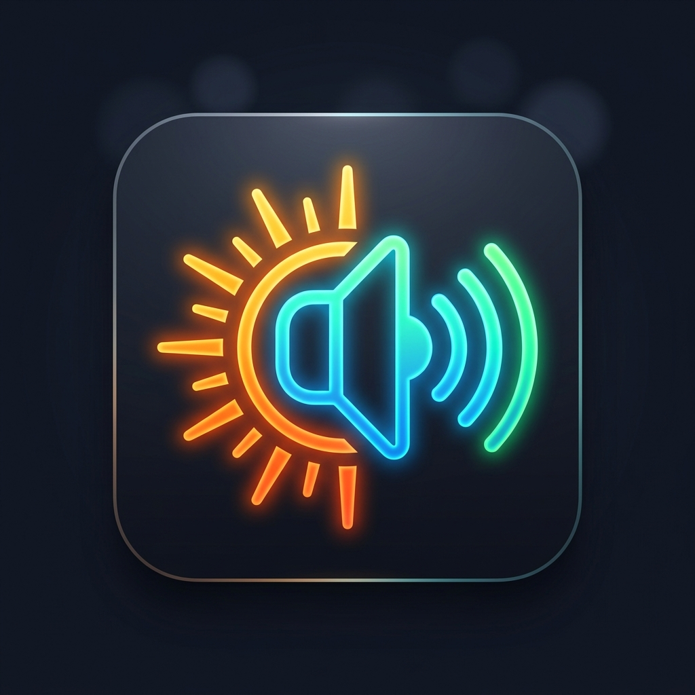

# VolBright 🌟

<p align="center">
  
</p>

<p align="center">
  <strong>High-performance, floating overlay controls for instant Volume, Brightness, and 4G/5G Network switching on Android.</strong>
</p>

<p align="center">
  
  
  
  
  
</p>

---

## 📖 Overview

**VolBright** is a native Android utility that places customizable, lightweight floating action buttons directly on your screen. It eliminates the wear-and-tear of physical hardware buttons and avoids breaking your immersion when watching videos, playing games, or multitasking.

Unlike traditional volume apps that require pulling down the notification shade or navigating multi-level menus, VolBright gives you **instant gesture controls right under your thumb**, paired with intelligent foreground-app tracking and automated network mode switching.

---

## ✨ Key Features

### 🔊 Floating Volume Control
- **Intuitive Drag Gestures:** Drag up/right to increase volume, down/left to decrease volume.
- **Visual Feedback:** Button illuminates **Green** during active adjustment.
- **Audio Stream Selection:** Control Media, Ring, Notification, Alarm, or System audio streams directly.

### ☀️ Floating Brightness Control
- **Direct Screen Brightness Adjustment:** Smooth, continuous slider interaction.
- **On-Screen Slider Overlay:** Real-time visual brightness feedback bar appears during adjustment.
- **Visual Feedback:** Button illuminates **Orange** during active adjustment.

### ⚡ 4G / 5G Network Mode Automation
- **Single-Tap Network Switching:** Instantly toggle between 4G (LTE) and 5G speeds without manually navigating 4–5 levels deep into Android Settings.
- **Accessibility Automation Script:** Automatically opens Mobile Network settings, navigates to your specified SIM, toggles the network preference, and returns you back to your foreground app in milliseconds.
- **Customizable OEM Labels:** Configure SIM name (e.g. `SIM 1`, `Jio`, `Airtel`), settings menu header, and 4G/5G option strings to support any device manufacturer (Google Pixel, Samsung One UI, OnePlus OxygenOS, Xiaomi MIUI/HyperOS, etc.).
- **Visual Feedback:** Button illuminates **Cyan** during active network toggling.

### 🎯 Gesture Mechanics & Layout Memory
- **Quick Drag:** Adjusts volume or brightness proportionally to swipe distance.
- **Long Press (300ms) → Move Mode:** Enters repositioning mode with haptic feedback; the button glows **Blue**, allowing you to drag it anywhere on screen.
- **Relative Ratio Persistence:** Button coordinates are saved as screen-percentage ratios (`X%`, `Y%`), ensuring buttons maintain their relative positions even when rotating between portrait and landscape modes or rebooting the device.

### 🛡️ Smart Context Awareness & Exclusions
- **Foreground App Detection:** Built upon Android's `AccessibilityService` (`AppForegroundTracker`) to detect package changes with zero battery-draining polling loops.
- **Excluded Apps Blacklist:** Choose specific applications (e.g., full-screen games, Netflix, YouTube, Camera) where the overlay automatically hides itself to avoid blocking controls.
- **Soft Keyboard Auto-Hide:** Automatically detects keyboard visibility and temporarily hides overlays to prevent accidental touches while typing.

### 🎨 Deep Customization
- **Independent Toggles:** Activate or deactivate Volume, Brightness, and Network buttons individually.
- **Size Control:** Dynamically scale button diameter from compact (30dp) to prominent (90dp).
- **Opacity Slider:** Adjust transparency from near-invisible ghost watermark (10%) to full solid contrast (100%).
- **Drag Sensitivity:** Fine-tune sensitivity to adjust full range with short swipes or high-precision long drags.

---

## 🏗️ Architecture & Folder Structure

VolBright is organized following modern Android development practices using Jetpack Compose, Kotlin Coroutines, and Android Architecture Components.

```
volbright/
├── app/
│   ├── src/
│   │   ├── main/
│   │   │   ├── java/com/example/volbright/
│   │   │   │   ├── MainActivity.kt               # Entry point activity hosting Jetpack Compose UI
│   │   │   │   ├── Navigation.kt                 # Type-safe navigation backstack & destinations
│   │   │   │   ├── NavigationKeys.kt             # Navigation keys (Main, ExcludedApps)
│   │   │   │   ├── FloatingWindowService.kt      # Foreground service managing floating overlay views & gestures
│   │   │   │   ├── AppForegroundTracker.kt       # AccessibilityService for app tracking & network automation
│   │   │   │   ├── data/
│   │   │   │   │   ├── PreferencesManager.kt     # SharedPreferences persistence layer
│   │   │   │   │   └── DataRepository.kt         # Data abstraction layer
│   │   │   │   ├── theme/
│   │   │   │   │   ├── Color.kt                  # Material 3 dark cyber color scheme
│   │   │   │   │   ├── Theme.kt                  # Compose theme configuration
│   │   │   │   │   └── Type.kt                   # Typography definitions
│   │   │   │   └── ui/
│   │   │   │       ├── MainScreen.kt             # Control center (toggles, sliders, network script settings)
│   │   │   │       └── ExcludedAppsScreen.kt     # Installed apps list with blacklist checkboxes & search
│   │   │   ├── res/
│   │   │   │   ├── drawable/                     # Vector icons (ic_volume, ic_brightness, ic_network)
│   │   │   │   ├── drawable-nodpi/               # Branding assets & application logo
│   │   │   │   ├── values/                       # Strings, colors, styles
│   │   │   │   └── xml/                          # Accessibility configuration & backup rules
│   │   │   └── AndroidManifest.xml               # Service declarations, activities, and permissions
│   │   └── test/                                 # JVM unit tests
│   ├── build.gradle.kts                          # Module-level Gradle configuration
│   └── .gitignore                                # Module-level gitignore
├── gradle/
│   ├── libs.versions.toml                        # Centralized Gradle version catalog
│   └── wrapper/                                  # Gradle wrapper binaries & properties
├── .gitignore                                    # Project-wide Git ignore rules
├── build.gradle.kts                              # Top-level build configuration
├── gradle.properties                             # JVM args and Gradle properties
├── gradlew / gradlew.bat                         # Gradle wrapper scripts
├── settings.gradle.kts                           # Module inclusion & plugin management
└── README.md                                     # Project documentation
```

---

## 🔐 Permissions Explained

VolBright utilizes specific system permissions to function reliably as an overlay and automation utility:

| Permission | Purpose |
| :--- | :--- |
| `android.permission.SYSTEM_ALERT_WINDOW` | Enables drawing floating action buttons over other apps. |
| `android.permission.WRITE_SETTINGS` | Required to adjust screen brightness programmatically. |
| `android.permission.BIND_ACCESSIBILITY_SERVICE` | Enables real-time foreground app detection for exclusion auto-hiding and UI automation for 4G/5G switching. |
| `android.permission.FOREGROUND_SERVICE` | Keeps the overlay service active without being killed by Android's background memory optimizer. |
| `android.permission.FOREGROUND_SERVICE_SPECIAL_USE` | Declares special-use foreground service status for floating overlays (Android 14+). |
| `android.permission.QUERY_ALL_PACKAGES` | Allows fetching installed apps on the device to populate the Excluded Apps selection list. |
| `android.permission.VIBRATE` | Provides subtle haptic feedback when entering button move mode. |

---

## 🚀 Getting Started & Installation

### Prerequisites
- Android Studio Ladybug / Jellyfish or newer
- JDK 17 or higher
- Android SDK (minSdk: 26 / Android 8.0, targetSdk: 35 / Android 15)
- Physical Android device (recommended for testing floating overlay, gestures, and accessibility services)

### Build from Source
1. **Clone the repository:**
   ```bash
   git clone https://github.com/snk189/volbright.git
   cd volbright
   ```

2. **Build Debug APK:**
   ```bash
   ./gradlew assembleDebug
   ```
   *(On Windows, use `.\gradlew.bat assembleDebug`)*

3. **Install on connected device via ADB:**
   ```bash
   adb install app/build/outputs/apk/debug/app-debug.apk
   ```

---

## 📱 Initial Setup Guide

1. **Launch VolBright:** Open the app from your launcher.
2. **Grant Display Over Other Apps:** Tap the overlay toggle; Android will prompt you to grant the "Display over other apps" permission.
3. **Grant Modify System Settings:** If Brightness control is enabled, grant permission to modify system settings.
4. **Enable Accessibility Service:** Go to **Settings → Accessibility → Downloaded Services → VolBright App Tracker** and turn it **ON**.
5. **Configure Network Script (Optional):**
   - If using the 4G/5G toggle, enter your SIM label (e.g. `SIM 1`) and the exact name of the network selection menu on your device (e.g. `Preferred network type`).
6. **Customize:** Adjust button size, opacity, and drag sensitivity according to your preference!

---

## 🤝 Contributing

Contributions, bug reports, and feature requests are welcome!
Feel free to open an issue or submit a pull request:
1. Fork the Project
2. Create your Feature Branch (`git checkout -b feature/AmazingFeature`)
3. Commit your Changes (`git commit -m 'Add some AmazingFeature'`)
4. Push to the Branch (`git push origin feature/AmazingFeature`)
5. Open a Pull Request

---

## 📄 License

This project is licensed under the Apache 2.0 / MIT License - see the repository for details.
